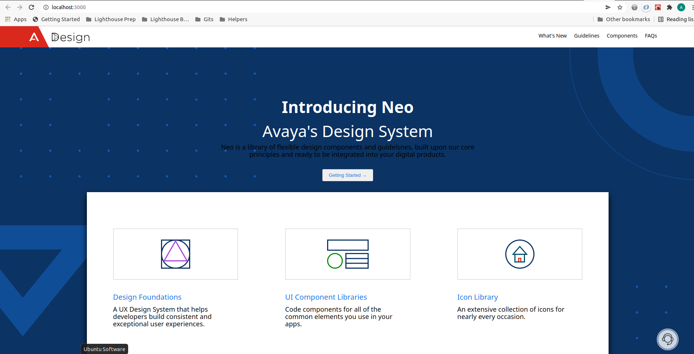

# Agent Bubbles

Agent Bubbles is an add-on that can be deployed on top of an existing app to provide assistance to users via chat functionality; Agent Bubbles connects the user to a live agent who can provide assistance in realtime.

## Project brief

 Agent Bubbles is built using React and utilizes React features such as built-in and custom hooks;
 Data is managed by an API server using a MongDB database. The client application communicates with the server over websocket.

## Setup

- Install dependencies with `npm install` after navigating to server and client folders in project root directory.
- Run the backend server with `npm run dev`.
- Start the front end client with `npm start`. app automatically launches at http://localhost:8000/
  (this app is designed to work with node v14.17.0 or later and npm v8.3.1; run `nvm use 14.17.0` or latest version of node if the app fails to start due to version error)

## Project Stack

- Front-End: React, JSX, HTML, CSS, JavaScript
- Back-End: Express, Node.js, MongoDB

## Dependencies

- react: "^17.0.2"
- react-dom: "^17.0.2"
- react-scripts: "5.0.0"
- socket.io-client: "^4.4.1"
- normalise.css

## Screenshots

